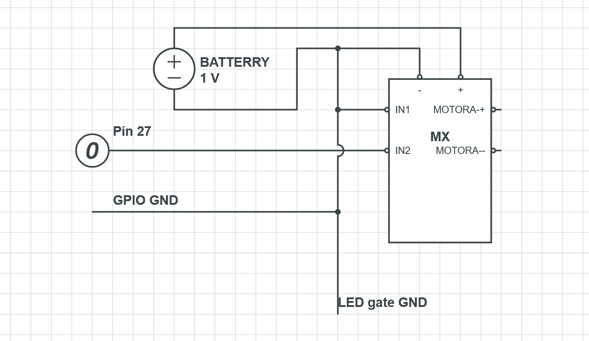

# Motor Tester

## CYD Motortester

This project written in c++ for esp32 CYD counts actual RPM of motor based on delta time between two snapshot and LED gate pulses that occured between them. It is controlled by touchscreen interface. For interfacing with touch screen it uses XPT2046_Bitbang for touch and TFT_eSPI for drawing on display. 

### 1 Tech stack

Frontend is basically handled by my own library UI.h which forms another layer on TFT_eSPI and uses it to draw buttons toggles progresbar. Programming language is c++.

#### 1.1 Electric components

As motor driver is used MX1508 LED gate sensor is generic LED gate sensor. Also there is a custom elecrical circuit.   

## Functional Requirements: CYD Motor Control & RPM Sensing

This document outlines the functional requirements for a system utilizing the **Cheap Yellow Display (ESP32-2432S028R)** to control a DC motor via PWM and measure its rotational speed using an LED gate (optical) sensor.

### 1. Requirement Summary Table

| ID | Category | Requirement | Description |
|:---|:---|:---|:---|
| FR-01 | Motor Control | PWM Signal Generation | The system shall generate a PWM signal via ESP32 GPIO to regulate effective motor voltage. |
| FR-02 | Motor Control | Minimum Start Threshold | The system shall activate the motor and slowly increase the pwm duty cycle and mark the value at whch motor starts spinning. |
| FR-03 | Motor Control | Soft-Start / Kickstart | The system shall apply a momentary high-voltage pulse (Kickstart) when transitioning from 0 to 1 to overcome static friction as user setting. |
| FR-04 | Sensing | Optical Interrupt Detection | The system shall detect state changes from the LED gate sensor using hardware interrupts. |
| FR-05 | Sensing | RPM Calculation Logic | The system shall calculate RPM based on the time delta between consecutive sensor pulses. |
| FR-06 | Sensing | Real-Time Display Refresh | The system shall refresh the RPM numerical data on the CYD screen about every 500ms. |
| FR-07 | Analysis | Input-Feedback Correlation | The system shall allow monitoring of the actual RPM vs. the commanded PWM (Activation Line). |
| FR-08 | UI/UX | Touch Control Interface | The system shall provide a touch interface for running tests. |
| FR-09 | UI/UX | Visual Speed Feedback | The system shall display the current RPM alongside a visual progress bar or graph. |
| FR-10 | Safety | Emergency Shutdown | The system shall provide a dedicated on-screen 'STOP' button to immediately zero the PWM output. |
| FR-11 | Safety | Stall Protection | The system shall disable PWM output if no pulses are detected for long time (user set) while power is commanded. |

### 2. Hardware Interface Mapping (CYD Specific)

| Component | ESP32 Pin (GPIO) | Mode |
|:---|:---|:---|
| **Motor PWM** | GPIO 27 | Output (LEDC) |
| **LED Gate Sensor** | GPIO 22 | Input (Internal Pull-up) |
| **TFT Display** | Standard SPI | Output |
| **Touch Controller** | Standard SPI | Input |

---
